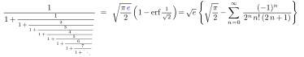
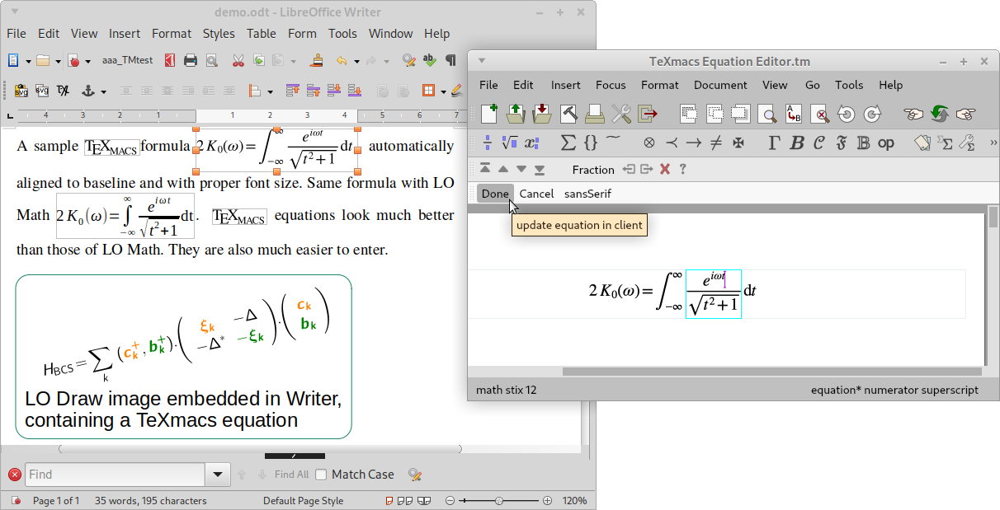

# Equation Editor for LibreOffice ([direct download](https://github.com/slowphil/SVG_and_TeXmacs_for_LibreOffice/releases/latest))

You need to prepare documents with equations but are struggling with LO Math, and do not want to learn how to code in LaTeX just for that? You are at the right place!

__The purposes of this extension are:__ 

* __Provide an easy, fully GUI, equation editor for LO__  
With this extension, one uses the Free and Open Source software GNU [TeXmacs](http://www.texmacs.org) to __directly enter equations in their final visual form__, using an extremely flexible and well though-out combination of toolbars, menus, and keyboard shortcuts...  And this can even be customized!    
With this extension there is no need to know anything of TeX/LaTeX for obtaining beautiful equations in LO such as  
  
(Also check the [samples](https://github.com/slowphil/SVG_and_TeXmacs_for_LibreOffice/tree/master/samples)).  
In spite of its very misleading name, TeXmacs is actually __not at all based on TeX/LaTeX__ ⇒ Unlike with LibreOffice Math or the TextMath extension, with TeXmacs you simply cannot make a syntax error while entering your equations!

* __Convert existing equations to TeXmacs equations on-the-fly__  
Whenever you select an existing equation in a LO document and call this extension, the equation is converted to a TeXmacs equation. Conversion works for

    * LibreOffice Math equations  
    (Microsoft Equations get converted to that in LibreOffice)

    * MathType equations (wmf drawings or OLE objects).
    * plain LaTeX markup in Writer.  
    Hence, if you have Latex material at hand or are proficient typing Latex, this is not wasted! Latex can also be pasted in TeXmacs while editing equations.

    * Other equations such as TextMath could olso be converted (contributions welcome)

* __Enable copy-pasting SVG drawings between LO and Inkscape__ (or any other app that handles SVG).  
Although LO has a pretty good support for SVG, when you copy a drawing in Inkscape it is disappointingly pasted as a bitmap in LO and it is not even possible to use "paste special" to get the vector format.  
With this extension, there is no need to go through a file for LO to exchange SVG with other apps.  
Equations appear as SVG images in LO (yet, they are fully re-editable).

## How it works:
After installation, Writer, Draw and Impress have an additional toolbar with 3 buttons that implement the functionalities of the extension:

*  This button pastes an SVG image from the clipboard
*  This copies a selected SVG image to the clipboard
*  Revise the selected equation with TeXmacs (converting it, if needed).  
Creates a new equation if nothing is selected. This opens a TeXmacs window in which one can edit the equation visually, as shown below:

 

In order to get a feeling of how easy it is to enter equations in TeXmacs and to kickstart you using it, I recommend watching a couple of short [tutorial videos](https://www.youtube.com/watch?v=iqjgN_KNHgM&list=PLjlnuLy3KEpYmUQvFIFSFgeYQjVYO2gxi&index=3) on TeXmacs. They should convince you that TeXmacs is really user-friendly. I have tried many systems over the years, and when it comes to laying out maths, TeXmacs simply has no competitor! Gone the hassle of aligning equations in LO Math, or debugging a long LaTeX markup!

The two buttons for Copying and Pasting of SVG act on the system clipboard (overcoming the shortcomings of LO's clipboard handling of SVG). This allows rapid 2-way exchange with Inkscape and pasting TeXmacs fragments (using "copy to image" in TeXmacs' Edit menu). These clipboard actions are not (not yet?) transparently integrated with LibreOffice's standard edit menu, and keyboard shortcuts. However, once the extension installed you can define your own menu (or contextual menu) entries, and/or keyboard shortcuts, if desired. The macros you woud target are respectively `paste_svg`, `copy_svg` and `edit_texmacs` inside the `TexmacsInkscape` Basic library.

## Miscellanous details

In Writer, equations are "anchored as characters" and automatically aligned to the baseline (for single line equations). If you want a displayed equation, define you own formating style for that.

In Writer, new equations are created with the current font size at the insertion point (except when converting LO math equations). Revised equations get their font size adjusted to their surrounding. If the size is off, change the output scale to 1 in TeXmacs preferences for conversion to images (one may want another default scale when working with Impress...) 

Numbering equations is not handled. Use LibreOffice tools for that.

In Draw and Impress, it is not possible to insert a TeXmacs equation inside a text frame, to obtain an inline equation (It does not work for LO Math either). The workarounds are :

* Write the entire text with inline equation(s) in TeXmacs
* In place of a text box, use an LO Writer OLE object  
There you can place Texmacs equations inline. Ironically this does not work with LO Math, because of this [bug](https://www.reddit.com/r/libreoffice/comments/iaza62/how_to_add_math_equations_along_with_text_on/?utm_source=share&utm_medium=web2x&context=3).

If you ever change the font size of a document, you'll need to manually update each equation in the document. This implies this extension is suitable only for documents containing a limited number of equations. If you want to write a document with hundreds of equations (say, a PhD thesis), consider using a real scientific word processor like TeXmacs... 

## Requirements
This extension is known to work in LibreOffice ⩾ 5.3 in both Linux and Windows. It was not tested in OpenOffice and probably won't work without modifications. If the extension fails to install properly, make sure you have `libreoffice-script-provider-python` installed.

Of course, you need to have TeXmacs installed on your system. 

For the TeXmacs equation editor feature to work with this LibreOffice extension, TeXmacs further needs the `equation-editor plugin` which is not yet distributed with the official version available at texmacs.org, at this point. The plugin can be installed manually, or one can get one of my texmacs builds incorporating it (see below).

You'll also need `pdftocairo` (from Poppler tools) that TeXmacs needs to produce the SVG images.

Both the plugin and pdf to cairo are bundled [in my windows builds](https://github.com/slowphil/mingw-w64-texmacs/releases/latest). For Linux, [the AppImage](https://download.opensuse.org/repositories/home:/slowphil:/texmacs-devel/AppImage/texmacs-latest-x86_64.AppImage) already contains the equation-editor plugin.

## Technical details
This is my first LO extension and it uses a mix of Basic and Python scripts: 
It is easier to hack with Basic as you find much more examples and help, on the other hand Python was more convenient for implementing a couple of things (like for instance working around a bug in the interfacing to windows clipboard in LO).

### Modifying and repacking the LO extension (.oxt file)
If you tweak the Basic code in LO and want to repack the extension, clone the repo and export your modified Basic library to the `TeXmacs_and_SVG` folder. Then open the `SVG_and_Texmacs.odt` (which is a just [Bernard Marcelly's __Extension Compiler__](https://wiki.openoffice.org/wiki/Extensions_Packager#Extension_Compiler) with proper settings for this extension set in the content of the Basic macro `Standard:Module1` in that file) and recompile the oxt in section 2.3.3 (full instructions in the file).

## Known issues
- Inserting SVG in rescued documents leads to an error: save them first.
- SVG images are well handled in native LO document formats (.odt, .odg, .odp). However, when saved as MS Office documents, LO converts SVG images to lousy bitmaps. When exporting to these formats it is possible to preserve the vector character by converting SVG to metafile images, but any equation then becomes non-editable…
- While an equation is opened for revision in TeXmacs, _all_ LO windows are unresponsive. Although it can be frustrating for the user, this is the expected behavior for this simple extension. To regain control of LO, terminate the edition in TeXmacs, by pressing  either the "done" or "cancel" button on the lower toolbar in TeXmacs.

## Credits
The extension is packaged using [Bernard Marcelly's excellent __Extension Compiler__](https://wiki.openoffice.org/wiki/Extensions_Packager#Extension_Compiler)
The conversion of MathType equations is based on the converter originaly included in the [Jex equation editor](http://levine.sscnet.ucla.edu/general/software/jex/), which was ported from Java to Python and adapted.
The icon of the TeXmacs toolbar button is based on an original design by Massimiliano Gubinelli.
